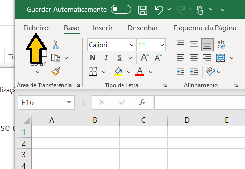
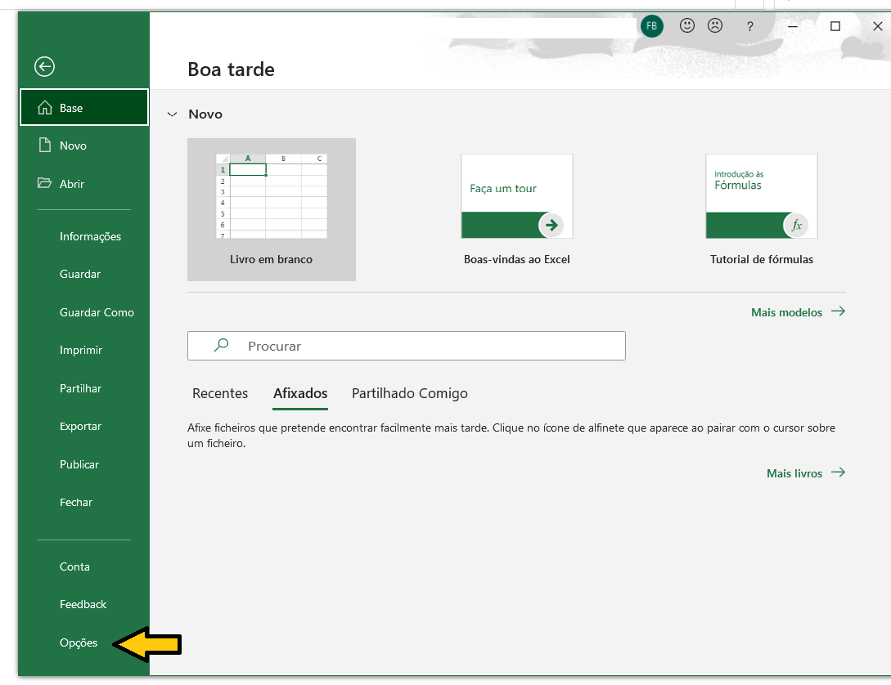
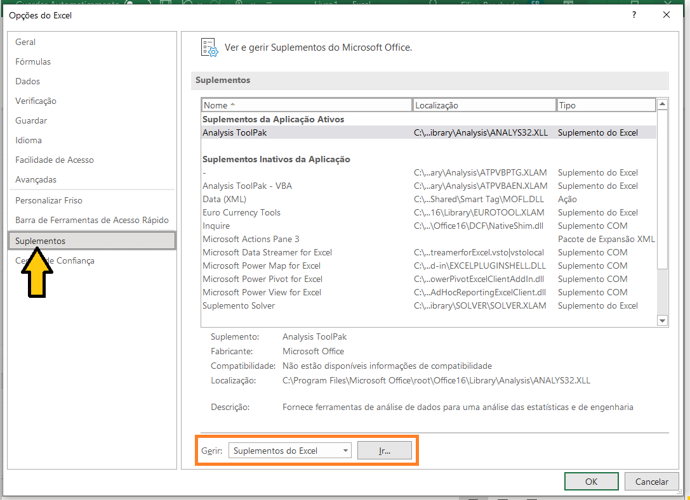
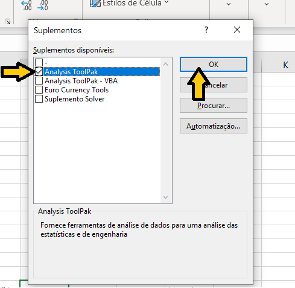
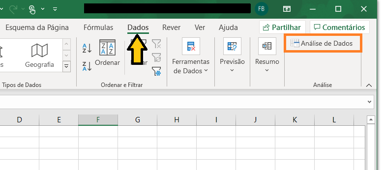

Instalar suplemento "Análise de Dados " do EXCEL :

- Separador **Ficheiro**:

- Selecionar **Opções**:

- Dentro das "Opções do Excel", selecionar separador **Suplementos**, e dentro desse separador, na parte de baixo, a opção **Gerir:** escolher **Suplementos do Excel** e clicar em **Ir...**:

- Na caixa "Suplementos" marcar a caixa de diálogo: **Analysis ToolPak** e clicar em **OK**.

- A ferramenta de Análise de Dados já está habilitada. Para confirmar, ir ao separador **Dados**, e no canto superior direito existe um novo sub-separador Análise com a opção **Análise de Dados**.

