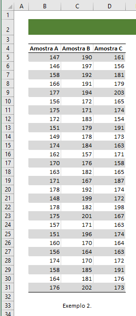
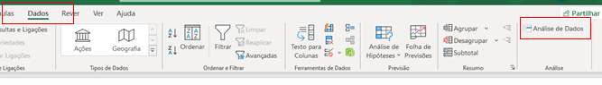
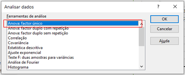
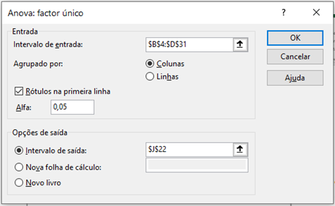
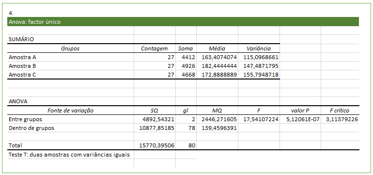

Como realizar uma análise de dados em EXCEL, de acordo com a **ANOVA Fator Único**, para o seguinte Exemplo:

1. Separador Dados, Opção "Análise de Dados".
   
   

2. Escolher o tipo ANOVA: fator único.
   
   

3. No campo "Intervalo de Entrada:", colocam-se todos os dados da observação, incluindo os cabeçalhos (atente com dados do Exemplo 2.)

4. Output:
   
   
